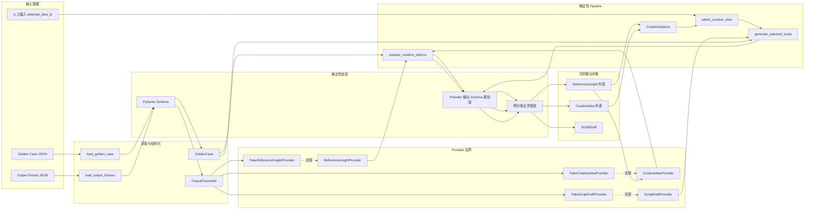
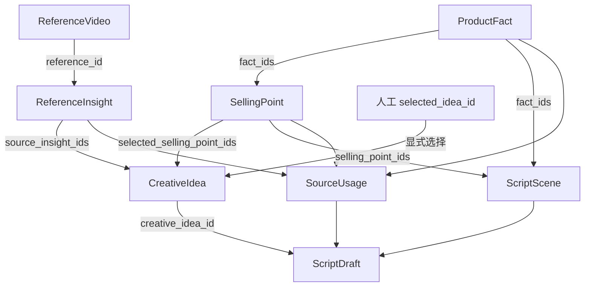

# SYSTEM_MAP

## 1. 文档定位

本文描述 `tk-script-agent-lab` 当前已经实现并经过测试的系统行为。

事实来源按优先级排列：

1. 当前源码；
2. 自动化测试；
3. Golden Case 和固定 fixture；
4. 项目 Roadmap 与阶段约束。

本文不是未来架构蓝图，也不把尚未实现的 LLM、RAG、LangGraph 或 Agent 能力画成当前能力。

当前覆盖：

- Phase 0：实验项目基线；
- Phase 1A：输入业务模型与 Golden Case 校验；
- Phase 1B：固定输出模型、fixture 与跨对象引用校验；
- Phase 1C：Provider 契约、Fake Provider、人工创意选择和确定性 pipeline。

Phase 1 主体能力已经建立，但按照 `LEARNING_ROADMAP.md`，仍需完成：

- 最小导出；
- Golden Case 完整端到端测试；
- Phase 1 总复盘。

---

## 2. 当前系统边界

| 当前已实现 | 当前未实现 |
|---|---|
| Golden Case JSON 加载 | 真实 LLM |
| Pydantic 领域模型 | OpenAI 或其他模型 SDK |
| 固定 ReferenceInsight fixture | Prompt 文件与 Prompt 版本 |
| 固定 CreativeIdea fixture | Structured Outputs API |
| 固定 ScriptDraft fixture | Token、成本和模型运行记录 |
| Provider Protocol | RAG |
| Fake Provider | LangGraph |
| 人工传入 `selected_idea_id` | Tool Calling |
| Provider 输出 Schema 重校验 | Agent 自主决策 |
| 跨对象确定性校验 | UI |
| pytest 自动测试 | 数据库 |
| 正常路径人工验证 | 完整 Run Trace |
| Fake Provider 无网络运行 | Eval 系统 |
| | 最小导出 |
| | Phase 1 Golden Case 完整 E2E |

当前没有模型节点。

Fake Provider 不是模型，也不模拟智能生成；它只是通过未来模型接口返回固定 fixture。

---

## 3. 当前数据流



当前转换链：

```text
JSON
→ Python dict / list
→ Pydantic 领域对象
→ 聚合对象
→ Provider 契约
→ Fake Provider 固定输出
→ 完整 Schema 重校验
→ 跨对象业务校验
→ CreativeOptions / ScriptDraft
```

---

## 4. 当前代码职责边界

| 位置 | 当前职责 | 不负责什么 |
|---|---|---|
| `domain/models.py` | 定义领域对象、字段类型、局部约束和部分对象内部唯一性 | 不证明商品事实真实 |
| `domain/validators.py` | Provider 输出重校验、ID 引用、版本、子集关系和 SourceUsage 关系 | 不生成创意和剧本 |
| `golden_case/loader.py` | 读取 Golden Case JSON 并构造 `GoldenCase` | 不分析参考视频 |
| `fixtures/loader.py` | 读取固定输出 fixture 并构造 `OutputFixtureSet` | 不代表真实模型输出 |
| `providers/protocols.py` | 定义三个业务 Provider 的能力契约 | 不定义通用 LLM 平台 |
| `providers/fake.py` | 返回 fixture 中对象的 deep copy | 不调用网络，不做规则生成 |
| `pipeline/deterministic.py` | 控制调用顺序、人工选择、错误边界和返回结果 | 不自动选择最佳创意 |
| `tests/` | 验证正常路径、错误注入、可重复性和边界行为 | 不证明业务内容优秀 |

---

## 5. 当前核心对象

| 对象 | 数据来源 | 主要职责 | 关键引用 | 主要校验位置 |
|---|---|---|---|---|
| `ProductProfile` | Golden Case | 描述商品版本和基础信息 | `product_version_id` | Pydantic、Golden Case 校验 |
| `ProductFact` | Golden Case | 表达可引用商品事实 | `fact_id`、`product_version_id` | Pydantic、Golden Case 校验 |
| `SellingPoint` | Golden Case | 将商品事实组织成业务卖点 | `fact_ids` | Golden Case 校验 |
| `ReferenceVideo` | Golden Case | 描述固定参考视频 | `reference_id` | Pydantic、Golden Case 校验 |
| `GoldenCase` | Golden Case loader | 聚合商品、事实、卖点和参考视频 | 多对象关系 | Golden Case 校验 |
| `ReferenceInsight` | 固定 fixture / Provider | 表达对参考视频的结构化洞察 | `reference_id` | Pydantic、shared validator |
| `CreativeIdea` | 固定 fixture / Provider | 表达候选创意 | selling point、insight | Pydantic、shared validator |
| `SourceUsage` | `ScriptDraft` | 声明剧本使用了哪些来源 | fact、selling point、insight | Pydantic、shared validator |
| `ScriptScene` | `ScriptDraft` | 表达单个剧本场景 | selling point、fact | Pydantic、shared validator |
| `ScriptDraft` | 固定 fixture / Provider | 表达所选创意对应的完整剧本 | creative idea、scene、source usage | Pydantic、shared validator |
| `OutputFixtureSet` | fixture loader | 聚合固定洞察、创意和剧本 | 内部输出对象 | Pydantic、shared validator |
| `CreativeOptions` | Phase 1C pipeline | 暂存洞察和创意候选 | insight、idea | pipeline 与 validator |

---

## 6. 当前引用拓扑



当前已执行的严格关系：

```text
ReferenceInsight.reference_id
∈ GoldenCase.ReferenceVideo.reference_id
```

```text
CreativeIdea.selected_selling_point_ids
⊆ GoldenCase.SellingPoint.selling_point_id
```

```text
CreativeIdea.source_insight_ids
⊆ 当前 Provider 返回的 ReferenceInsight.insight_id
```

```text
ScriptDraft.creative_idea_id
= 人工选择的 selected_idea_id
```

```text
ScriptScene.selling_point_ids
⊆ 所选 CreativeIdea.selected_selling_point_ids
```

```text
ScriptScene.fact_ids
⊆ 当前 Scene 所引用 SellingPoint.fact_ids 的并集
```

```text
SourceUsage(product_fact).source_id
∈ 所有 ScriptScene.fact_ids 的并集
```

```text
SourceUsage(selling_point).source_id
∈ 所有 ScriptScene.selling_point_ids 的并集
```

```text
SourceUsage(reference_insight).source_id
⊆ 所选 CreativeIdea.source_insight_ids
```

---

## 7. 确定性规则

| 规则 | 实现位置 | 失败结果 | 为什么必须由代码完成 | 代表性测试 |
|---|---|---|---|---|
| 必填文本不能是空白 | Pydantic | `OutputSchemaError` 或模型校验错误 | 模型不能自行保证字段完整 | `test_prepare_options_revalidates_creative_idea_schema` |
| 额外字段禁止 | Pydantic `extra="forbid"` | Schema 错误 | 防止输出合同漂移 | `test_output_models_reject_unknown_fields` |
| Scene 时长必须大于 0 | Pydantic | `ProviderOutputError` | 数值边界必须稳定 | `test_generate_script_revalidates_nested_scene_schema` |
| SourceUsage 类型受 Literal 限制 | Pydantic + 防御性代码 | `ProviderOutputError` | 防止未知来源类型进入业务链 | `test_generate_script_revalidates_nested_source_usage_schema` |
| ID 必须唯一 | 模型 validator / shared validator | `OutputValidationError` | 唯一性不能靠文本语义保证 | duplicate ID 相关测试 |
| 商品版本必须一致 | shared validator | `OutputReferenceError` | 防止跨版本污染 | `test_generate_script_rejects_wrong_product_version` |
| ReferenceInsight 必须引用现有视频 | shared validator | `ProviderOutputError` | ID 存在性是确定性规则 | `test_prepare_options_rejects_missing_reference_id` |
| CreativeIdea 必须引用现有卖点 | shared validator | `ProviderOutputError` | 防止模型编造卖点 ID | `test_prepare_options_rejects_missing_selling_point_id` |
| CreativeIdea 只能引用当前洞察 | shared validator | `ProviderOutputError` | 防止跨运行引用 | `test_prepare_options_rejects_idea_insight_not_returned_by_provider` |
| 人工选择必须显式传入 | pipeline | `CreativeSelectionError` | 系统不得替人自动决定 | `test_select_creative_idea_requires_explicit_existing_unique_id` |
| 剧本必须匹配人工所选创意 | shared validator | `ProviderOutputError` | Provider 不能绕过人工决定 | `test_generate_script_rejects_script_for_different_selected_idea` |
| Scene 卖点必须属于所选创意 | shared validator | `ProviderOutputError` | 防止创意漂移 | `test_generate_script_rejects_scene_selling_point_outside_selected_idea` |
| Scene fact 必须支持当前卖点 | shared validator | `ProviderOutputError` | 防止事实与卖点错配 | `test_generate_script_rejects_fact_not_supported_by_scene_selling_point` |
| SourceUsage fact 必须实际出现在 Scene | shared validator | `ProviderOutputError` | 防止虚假来源声明 | `test_generate_script_rejects_source_usage_fact_not_used_in_scenes` |
| SourceUsage selling point 必须实际出现在 Scene | shared validator | `ProviderOutputError` | 防止虚假来源声明 | `test_generate_script_rejects_source_usage_selling_point_not_used_in_scenes` |
| Provider 返回对象必须重新执行完整 Schema | `_revalidate_model()` | `OutputSchemaError` → `ProviderOutputError` | `model_copy(update=...)` 可绕过字段校验 | Phase 1C v2 新增四项测试 |
| Placeholder 不能进入 production-ready | `GoldenCase.require_production_ready()` | Golden Case 校验错误 | 学习数据不能假装生产数据 | Golden Case production-ready 测试 |

---

## 8. 当前调用链

### 8.1 Golden Case

```text
load_golden_case(path)
→ 检查目录和必需文件
→ 读取 JSON
→ 校验 JSON 根结构
→ 构造 ProductProfile / ProductFact / SellingPoint / ReferenceVideo
→ 构造 GoldenCase
→ 检查版本、唯一 ID 和引用关系
→ 返回 GoldenCase
```

### 8.2 固定输出 fixture

```text
load_output_fixtures(path, golden_case)
→ 检查目录和三个 fixture 文件
→ 读取 JSON
→ 构造 ReferenceInsight / CreativeIdea / ScriptDraft
→ 构造 OutputFixtureSet
→ 调用 validate_output_fixture_set
→ 返回 OutputFixtureSet
```

### 8.3 准备创意候选

```text
prepare_creative_options(
    golden_case,
    insight_provider,
    idea_provider
)
→ 调用 ReferenceInsightProvider.generate
→ 重新执行 ReferenceInsight Schema
→ 校验 reference_id
→ 调用 CreativeIdeaProvider.generate
→ 重新执行 CreativeIdea Schema
→ 校验 selling point 和 insight 引用
→ 返回 CreativeOptions
```

### 8.4 人工选择与生成剧本

```text
外部人工传入 selected_idea_id
→ select_creative_idea
→ 检查 ID 非空、存在且唯一
→ 调用 ScriptDraftProvider.generate
→ 重新执行完整 ScriptDraft Schema
→ 校验人工选择、版本、Scene、fact、SourceUsage
→ 返回 ScriptDraft
```

---

## 9. 人工闸门

当前系统不会自动选择创意。

```text
prepare_creative_options()
→ 返回 CreativeIdea 候选列表
→ 系统停止自动推进
→ 外部人工查看候选
→ 显式传入 selected_idea_id
→ generate_selected_script()
→ 系统继续
```

当前人工闸门只通过函数参数表达：

```python
selected_idea_id: str
```

当前没有：

- UI；
- LangGraph interrupt；
- 审批记录；
- 自动评分；
- 默认选择第一条；
- “最佳创意”自动决策。

---

## 10. Provider 与 Fake Provider

### Provider Protocol

当前只定义三个业务契约：

```text
ReferenceInsightProvider
CreativeIdeaProvider
ScriptDraftProvider
```

Pipeline 依赖 Protocol，而不是依赖具体 Fake 类。

这允许未来在不重写业务调用链的前提下，把：

```text
Fake Provider
```

替换为：

```text
真实 LLM Provider
```

### Fake Provider

Fake Provider：

- 初始化时接收 `OutputFixtureSet`；
- 返回固定对象的 deep copy；
- 不读取具体 fixture 文件名；
- 不访问网络；
- 不读取 API Key；
- 不使用随机数；
- 不依赖当前时间；
- 不生成新文本；
- 不根据输入计算内容。

因此：

```text
Fixture
= 固定数据

Fake Provider
= 通过 Provider 契约返回固定数据的实现
```

二者不是同一层职责。

---

## 11. AI 产品经理六问

### 1. 数据从哪里进来

当前有三类输入：

1. Golden Case JSON：
   - 商品资料；
   - 商品事实；
   - 卖点；
   - 参考视频。

2. 固定 output fixture：
   - ReferenceInsight；
   - CreativeIdea；
   - ScriptDraft。

3. 人工输入：
   - `selected_idea_id`。

当前不存在真实模型响应。

### 2. 中间经过哪些转换

```text
JSON
→ Python dict / list
→ Pydantic 模型
→ GoldenCase / OutputFixtureSet
→ Fake Provider
→ Provider Protocol
→ CreativeOptions
→ 人工选择
→ ScriptDraft
→ Schema 重校验
→ 跨对象业务校验
```

### 3. 哪一步由模型完成

当前没有真实模型参与。

Fake Provider 只占据未来模型的位置，并返回固定 fixture。

固定 fixture 不能被描述为真实模型输出。

### 4. 哪一步必须由确定性代码完成

以下规则不能交给模型自行保证：

- Schema；
- 必填字段；
- 字段类型；
- ID 唯一性；
- 商品版本一致；
- 引用存在性；
- Scene 与所选创意的子集关系；
- fact 与卖点支持关系；
- SourceUsage 与实际 Scene 使用关系；
- 人工选择 ID；
- production-ready 闸门；
- Provider 输出重新校验。

### 5. 系统可能在哪里说谎

即使当前所有测试都通过，系统仍可能在以下位置“说谎”：

- 商品事实字段合法，但内容本身是假的；
- 供应商提供的事实不可信；
- ReferenceInsight 引用了真实视频，但文字并不忠实；
- CreativeIdea 引用了合法卖点，但创意质量很差；
- ScriptDraft 结构完整，但不适合 TikTok；
- SourceUsage 合法，不代表自由文本真的严格使用了来源；
- Fake Provider 输出看起来像模型结果，但实际上只是 fixture；
- 固定案例成功不能证明真实 LLM 稳定；
- 测试只覆盖已写出的风险，不证明未知场景正确。

### 6. 如何证明它做对了

当前可以通过以下证据证明部分正确性：

- 正常 Golden Case 可以加载；
- 非法 JSON、Schema 和引用会失败；
- Provider 可以替换；
- Fake Provider 输出固定且相互隔离；
- 不存在的人工选择会失败；
- 剧本不能绕过人工选择；
- 非法 Provider 输出会重新执行 Schema 校验；
- Scene、fact、selling point 和 SourceUsage 关系会被确定性检查；
- 相同输入重复运行结果一致；
- Fake Provider 不使用网络、随机数、时间和 API Key；
- pytest 全部通过；
- 正常和错误路径经过人工验证。

当前不能由 pytest 独立证明：

- 商品事实真实；
- 创意优秀；
- 剧本能转化；
- 真实模型稳定；
- Prompt 有效；
- RAG 有效；
- 系统已达到生产可用。

---

## 12. 当前证据与盲区

| 已有证据 | 尚未证明 |
|---|---|
| Golden Case 正常路径测试 | 商品事实真实性 |
| Schema 错误注入测试 | 参考洞察是否准确 |
| 引用错配测试 | 创意质量 |
| Provider 替换测试 | 真实模型输出稳定性 |
| Fake Provider deep-copy 测试 | Prompt 质量 |
| 无网络和无随机测试 | TikTok 业务效果 |
| 人工选择错误测试 | 人工选择是否正确 |
| 相同输入结果一致 | 真实生成结果可重复性 |
| 87 项自动测试通过 | 所有未知边界情况 |
| Phase 1C 手工验证通过 | Phase 1 完整导出闭环 |

---

## 13. Phase 1 当前状态

```text
Phase 1A
输入业务模型与 Golden Case
已完成

Phase 1B
固定输出模型、fixture 和跨对象引用
已完成

Phase 1C
Provider Protocol、Fake Provider、人工选择和确定性 pipeline
已完成并通过 Review

Phase 1 Closeout
最小导出
尚未完成

Golden Case 完整端到端测试
尚未完成

Phase 1 总复盘
尚未完成
```

当前不要进入真实 LLM，直到 Phase 1 Closeout 完成。

---

## 14. 更新规则

每个 Phase 完成并通过 Review 后更新本文一次。

更新要求：

1. 新增领域对象时，更新对象表；
2. 新增调用步骤时，更新数据流；
3. 新增确定性规则时，更新规则表；
4. 真实模型接入后，明确标记模型节点；
5. 不把 Provider、RAG、LangGraph 或 Agent 预先画成已实现；
6. 六问必须根据实际代码重新回答；
7. 删除已经失效的描述；
8. 历史版本由 Git 保存，本文不维护手工变更日志；
9. 本文始终保持为当前系统地图，不扩展成大型文档体系。