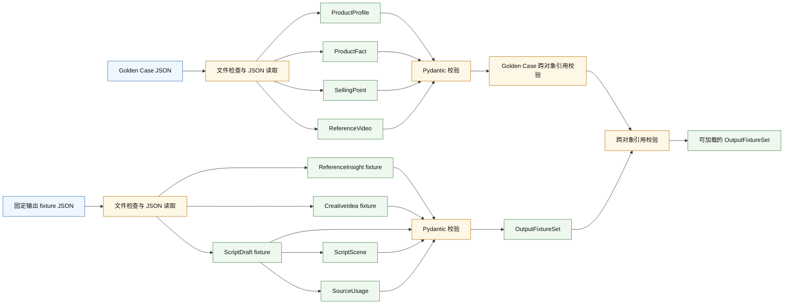
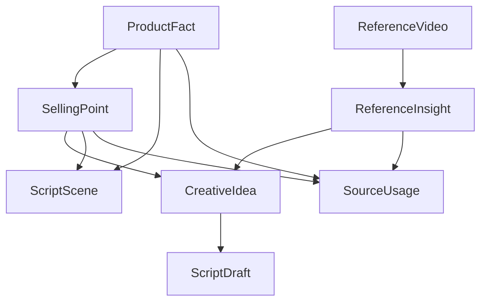

# SYSTEM_MAP

## 1. 文档定位

本文描述 `tk-script-agent-lab` 当前实际行为，事实来源是源码、fixture、Golden Case 数据和测试。本文不是未来架构规划；未实现内容不会画成已实现调用链。每个 Phase 完成并通过 Review 后，应更新一次本文。

当前覆盖：
- Phase 0
- Phase 1A
- Phase 1B 当前工作区状态

当前 Git 状态是未提交工作区版本：`git status --short` 显示 `FILE_MANIFEST.txt`、`src/tk_script_agent_lab/domain/__init__.py`、`src/tk_script_agent_lab/domain/errors.py`、`src/tk_script_agent_lab/domain/models.py` 已修改，并存在 `data/fixtures/car_vacuum_v1/`、`src/tk_script_agent_lab/fixtures/`、`tests/test_output_fixtures.py`、`tests/test_output_models.py`、`tk-script-agent-lab-phase1b-review.patch` 等未跟踪内容。本文按当前工作区内容描述，不把它假定为正式提交基线。

开始前检查结果：`git log -3 --oneline` 为 `f93f7cb feat: add phase 1a domain models and golden case validation`、`b9572e9 chore: establish phase 0 project baseline`、`46bcfb9 first commit`。系统 `python --version` 与 `python -m pytest` 均失败：`command not found: python`。项目虚拟环境可用，`.venv/bin/python --version` 为 Python 3.12.13，`.venv/bin/python -m pytest` 通过：`60 passed in 0.14s`。

## 2. 当前系统边界

| 当前已实现 | 当前未实现 |
|---|---|
| Golden Case 加载 | Fake Provider |
| Pydantic 模型 | 真实 LLM |
| 固定输出 fixture | Prompt |
| 确定性引用校验 | RAG |
| pytest 验证 | LangGraph |
| placeholder production-ready 闸门 | Streamlit UI |

## 3. 当前数据流



当前没有模型节点。`ReferenceInsight`、`CreativeIdea` 和 `ScriptDraft` 来自固定 fixture，不是模型输出。

## 4. 当前对象关系

| 对象 | 数据来源 | 主要职责 | 关键引用 | 由谁校验 |
|---|---|---|---|---|
| ProductProfile | `product_profile.json` | 商品版本、目标市场、禁用表达和 placeholder 标记来源 | `product_version_id` | Pydantic；`GoldenCase.validate_cross_references` |
| ProductFact | `product_facts.json` | 商品事实和允许使用方式 | `product_version_id` 指向 ProductProfile | Pydantic；`GoldenCase.validate_cross_references` |
| SellingPoint | `selling_points.json` | 把卖点绑定到事实支撑 | `fact_ids` 指向 ProductFact | Pydantic；`GoldenCase.validate_cross_references` |
| ReferenceVideo | `reference_videos.json` | 保存人工参考视频摘要和不可复制内容 | `reference_id` 被 ReferenceInsight 引用 | Pydantic；`GoldenCase.validate_cross_references` |
| GoldenCase | loader 聚合对象 | 聚合商品、事实、卖点和参考视频 | ProductProfile/ProductFact/SellingPoint/ReferenceVideo | `load_golden_case` 与模型校验 |
| ReferenceInsight | `reference_insights.json` | 固定参考洞察 fixture | `reference_id` 指向 ReferenceVideo | Pydantic；`_validate_against_golden_case` |
| CreativeIdea | `creative_ideas.json` | 固定创意 fixture | `selected_selling_point_ids`、`source_insight_ids` | Pydantic；`_validate_against_golden_case` |
| SourceUsage | `script_draft.json` | 声明剧本使用的来源类型和 ID | `source_type` + `source_id` | Pydantic Literal；`_validate_source_usage` |
| ScriptScene | `script_draft.json` | 剧本分镜和口播片段 | `selling_point_ids`、`fact_ids` | Pydantic；`ScriptDraft.validate_script_ids`；`_validate_against_golden_case` |
| ScriptDraft | `script_draft.json` | 固定剧本 fixture 和来源声明集合 | `creative_idea_id` 指向 CreativeIdea | Pydantic；`ScriptDraft.validate_script_ids`；`_validate_against_golden_case` |
| OutputFixtureSet | loader 聚合对象 | 聚合固定输出 fixture | ReferenceInsight/CreativeIdea/ScriptDraft | `load_output_fixtures` 与模型校验 |

## 5. 当前引用拓扑



当前源码已执行的更严格规则：

```text
ScriptScene.selling_point_ids
⊆ selected CreativeIdea.selected_selling_point_ids
```

```text
ScriptScene.fact_ids
⊆ 当前 Scene 所引用 SellingPoint.fact_ids 的并集
```

```text
ScriptDraft.source_usages(reference_insight)
⊆ selected CreativeIdea.source_insight_ids
```

当前未校验：`SourceUsage.used_for`、`ScriptScene.visual`、`ScriptScene.voiceover` 和 `CreativeIdea` 自由文本是否语义忠实使用来源。代码只校验结构、枚举、ID 存在性和部分子集关系。

## 6. 确定性规则表

| 规则 | 实现位置 | 失败结果 | 为什么必须由代码完成 | 对应测试 |
|---|---|---|---|---|
| 必填字段非空 | `NonEmptyString`、`Field(min_length=1)`、`Field(gt=0)` | `GoldenCaseValidationError`、`OutputSchemaError` 或直接 `ValidationError` | 空字段和非正时长是结构错误，不能让模型自行解释 | `test_required_string_field_must_not_be_blank`、`test_output_models_require_non_empty_text`、`test_reference_insight_empty_summary_fails`、`test_creative_idea_empty_hook_fails`、`test_script_scene_duration_must_be_positive` |
| 额外字段禁止 | `ExtraForbidModel` | `OutputSchemaError` 或直接 `ValidationError` | 防止模型或 fixture 偷带未定义字段绕过契约 | `test_output_models_reject_unknown_fields`、`test_reference_insight_unknown_field_fails`、`test_script_unknown_field_fails` |
| ID 唯一 | `GoldenCase.validate_cross_references`、`OutputFixtureSet.validate_output_ids`、`ScriptDraft.validate_script_ids` | `GoldenCaseValidationError` 或 `OutputValidationError` | ID 冲突会让引用不可判定 | `test_duplicate_product_fact_id_fails`、`test_duplicate_selling_point_id_fails`、`test_duplicate_reference_video_id_fails`、`test_reference_insight_duplicate_id_fails`、`test_creative_idea_duplicate_id_fails`、`test_script_duplicate_scene_id_fails`、`test_source_usage_duplicate_id_fails` |
| `product_version_id` 一致 | `GoldenCase.validate_cross_references`、`_validate_against_golden_case` | `GoldenCaseValidationError` 或 `OutputReferenceError` | 防止跨商品版本混用事实和剧本 | `test_product_version_mismatch_fails`、`test_script_product_version_mismatch_fails` |
| `SellingPoint.fact_ids` 存在 | `GoldenCase.validate_cross_references` | `GoldenCaseValidationError` | 卖点必须有事实支撑 | `test_missing_fact_reference_fails` |
| `ReferenceInsight.reference_id` 存在 | `_validate_against_golden_case` | `OutputReferenceError` | 参考洞察不能引用不存在的视频 | `test_reference_insight_missing_reference_id_fails` |
| `CreativeIdea` 引用存在 | `_validate_against_golden_case` | `OutputReferenceError` | 创意必须绑定已知卖点和已知洞察 | `test_creative_idea_missing_selling_point_id_fails`、`test_creative_idea_missing_insight_id_fails` |
| `ScriptDraft.creative_idea_id` 存在 | `_validate_against_golden_case` | `OutputReferenceError` | 剧本必须基于一条已知创意 | `test_script_missing_creative_idea_id_fails` |
| Scene 卖点不能绕过所选创意 | `_validate_against_golden_case` | `OutputReferenceError` | 剧本不能在选定创意之外追加卖点 | `test_script_scene_selling_point_must_belong_to_selected_idea` |
| Scene fact 必须支持当前卖点 | `_validate_against_golden_case` | `OutputReferenceError` | 分镜事实必须由该分镜卖点支持，不能跨卖点借事实 | `test_script_scene_fact_must_be_supported_by_scene_selling_points` |
| `SourceUsage` 类型和 ID 匹配 | `SourceType`、`_validate_source_usage` | `OutputSchemaError` 或 `OutputReferenceError` | 来源类型和 ID 必须确定，不能靠文本猜测 | `test_source_usage_restricts_source_type`、`test_source_usage_invalid_source_type_fails`、`test_source_usage_type_mismatch_fails`、`test_source_usage_missing_source_id_fails` |
| placeholder 不能作为 production-ready 数据 | `GoldenCase.is_placeholder`、`GoldenCase.require_production_ready` | `GoldenCaseValidationError` | 测试模板不能被误用为真实商品资料 | `test_golden_case_is_marked_as_placeholder`、`test_placeholder_case_is_not_production_ready`、`test_mixed_placeholder_reference_keeps_case_non_production` |

## 7. 当前调用链

```text
load_golden_case(path)
→ 文件检查
→ JSON 读取
→ Pydantic 模型
→ GoldenCase 聚合校验
→ GoldenCase
```

`load_golden_case(path)` 接收 Golden Case 目录路径。文件检查确认目录存在且是目录；JSON 读取加载 `product_profile.json`、`product_facts.json`、`selling_points.json`、`reference_videos.json`；Pydantic 模型把原始 dict/list 转成 `ProductProfile`、`ProductFact`、`SellingPoint`、`ReferenceVideo`；聚合校验检查 ID 唯一、版本一致和卖点事实引用；成功返回 `GoldenCase`。

```text
load_output_fixtures(path, golden_case)
→ 文件检查
→ JSON 读取
→ Pydantic 输出模型
→ OutputFixtureSet
→ Golden Case 跨对象校验
→ OutputFixtureSet
```

`load_output_fixtures(path, golden_case)` 接收输出 fixture 目录和已加载的 `GoldenCase`。文件检查确认 fixture 目录存在；JSON 读取加载 `reference_insights.json`、`creative_ideas.json`、`script_draft.json`；Pydantic 输出模型生成 `ReferenceInsight`、`CreativeIdea`、`ScriptDraft`、`ScriptScene`、`SourceUsage`；`OutputFixtureSet` 检查输出 ID 唯一；跨对象校验再对照 Golden Case 检查引用、版本和子集关系；成功返回同一个 `OutputFixtureSet`。

## 8. AI 产品经理六问

### 1. 数据从哪里进来

Golden Case 输入来自 `data/golden_cases/car_vacuum_v1/` 下的商品资料、商品事实、卖点和参考视频 JSON。固定输出 fixture 来自 `data/fixtures/car_vacuum_v1/` 下的参考洞察、创意和剧本 JSON。当前不存在真实模型输入，也没有 Prompt、Provider、RAG 或 LangGraph 运行节点。

### 2. 中间经过哪些转换

当前转换链是：

```text
JSON
→ Python 原始数据
→ Pydantic 模型
→ 聚合对象
→ 确定性引用校验
```

Golden Case 和输出 fixture 都经过文件、JSON root 类型、Pydantic Schema、ID 和跨对象引用校验。

### 3. 哪一步由模型完成

没有模型参与。

固定 fixture 不得被描述成模型输出。`reference_insights.json`、`creative_ideas.json` 和 `script_draft.json` 都是学习测试 fixture。

### 4. 哪一步必须由确定性代码完成

必须由代码完成的部分包括：Schema 校验、必填字段、ID 唯一、`product_version_id` 一致、引用存在性、Scene 与选中 CreativeIdea 的子集关系、Scene fact 与当前卖点支撑关系、`SourceUsage` 类型和 ID 匹配、placeholder production-ready 闸门。

### 5. 系统可能在哪里说谎

JSON 结构正确不代表商品事实真实；`ProductFact.evidence_source` 当前只是字段值，不会自动验证外部证据。引用存在不代表自由文本忠实使用来源，代码不会理解 `visual`、`voiceover`、`hook` 或 `used_for` 的语义。固定 fixture 不能证明真实模型质量。测试通过不能证明未覆盖场景正确。当前 `SourceUsage` 只能证明声明的来源类型和 ID 匹配，不能证明剧本文本实际使用了该来源。

### 6. 如何证明它做对了

Schema 正确由 Pydantic 和 schema/字段测试证明。引用关系正确由 loader 跨对象校验和错误注入测试证明。调用确定性由重复加载 fixture 的测试证明。业务内容质量需要人工审核、rubric 或后续 Eval 证明。商品事实真实性需要权威商品资料或外部证据证明，当前代码不能独立证明。

`pytest` 能证明代码规则按测试预期执行，不能独立证明商品事实和创意文本真实、优秀。

## 9. 当前证据与盲区

| 已有证据 | 尚未证明 |
|---|---|
| `.venv/bin/python -m pytest` 正常路径：60 passed | 商品事实真实性 |
| 错误注入测试覆盖缺文件、坏 JSON、重复 ID、缺引用和子集违规 | 创意质量 |
| 固定输入重复加载结果一致 | 真实模型稳定性 |
| 引用校验覆盖 SourceUsage 类型和 ID 匹配 | 文本是否忠实表达来源 |
| Golden Case 运行可加载 4 facts、3 selling points、3 reference videos；fixture 可加载 3 insights、3 ideas、`sd_001` | Run Trace 尚未产生，`run_traces/` 当前只有 `.gitkeep` |

## 10. 下一阶段更新规则

1. 每个 Phase 完成并通过 Review 后更新一次。
2. 新对象加入对象关系表。
3. 新调用加入数据流图。
4. 新模型步骤标出模型边界。
5. 新确定性规则加入规则表。
6. 六问根据实际源码重新回答。
7. 删除已经失效的描述，不保留历史副本。

历史变化由 Git 保存，不在 `SYSTEM_MAP.md` 维护版本日志。
